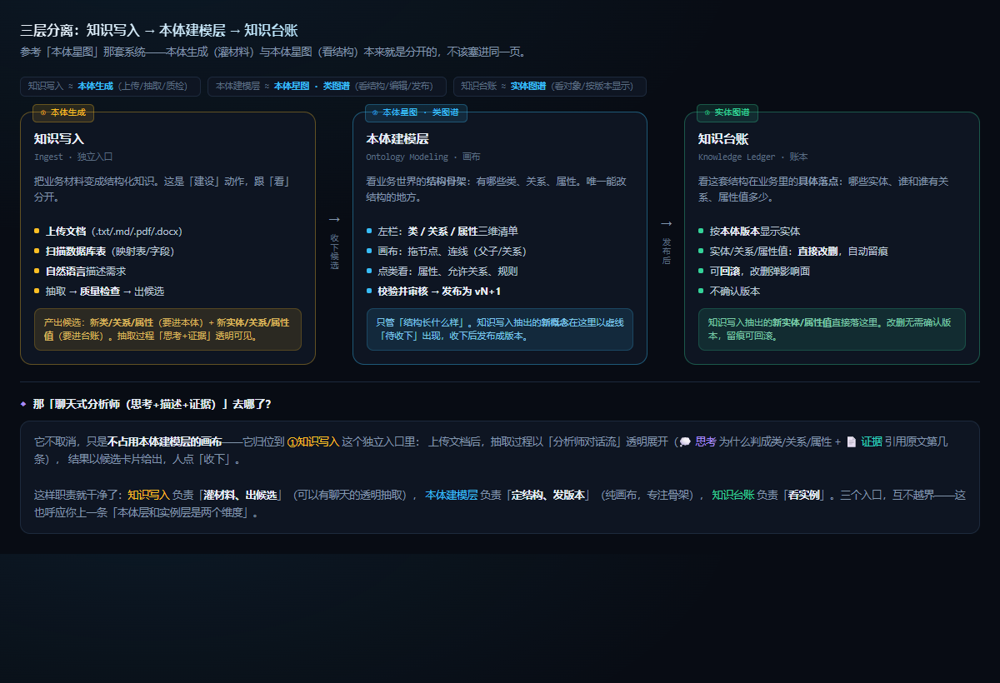
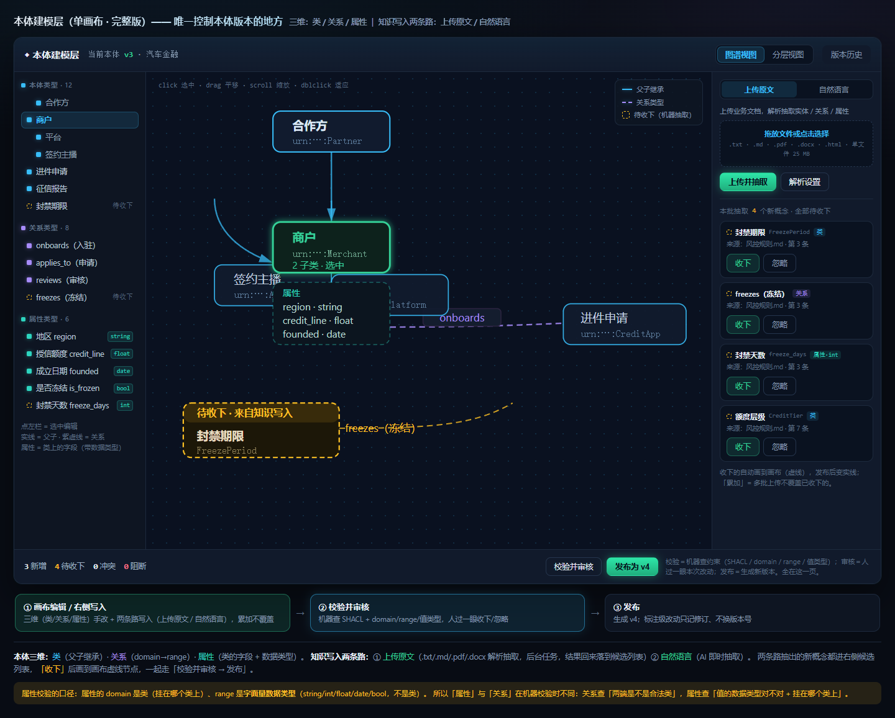
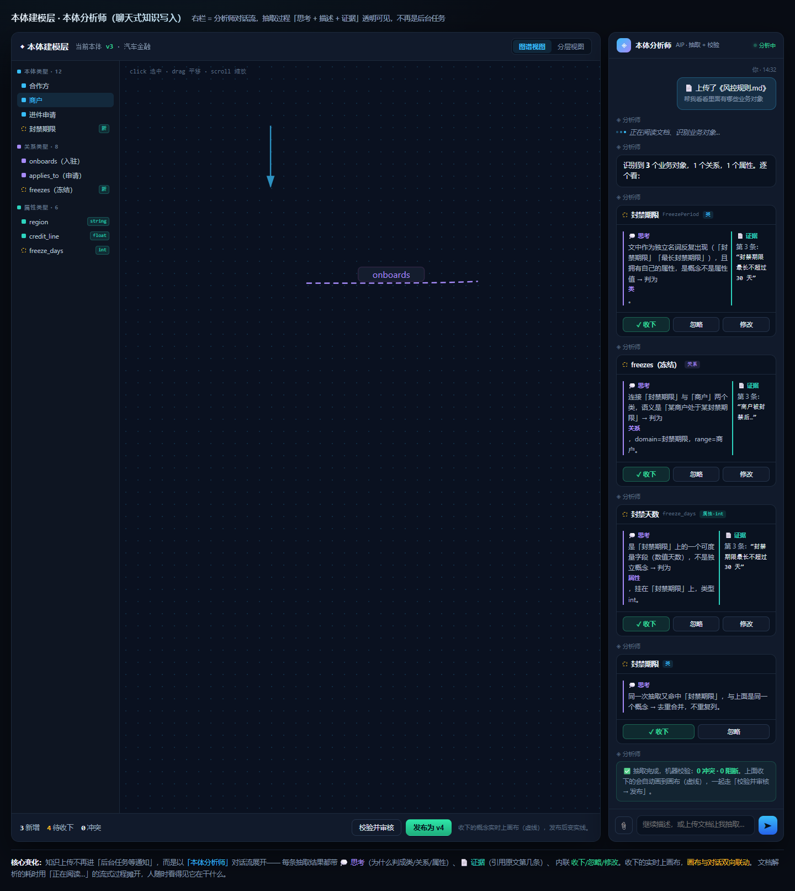
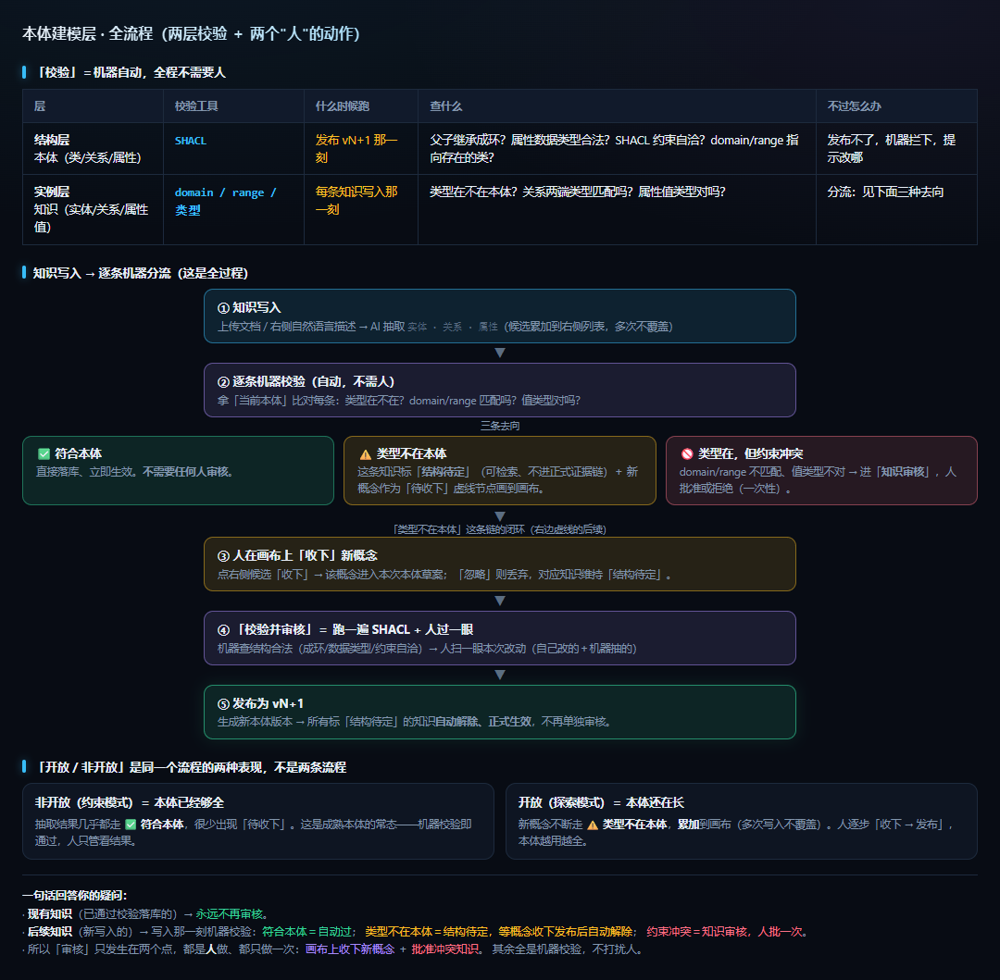
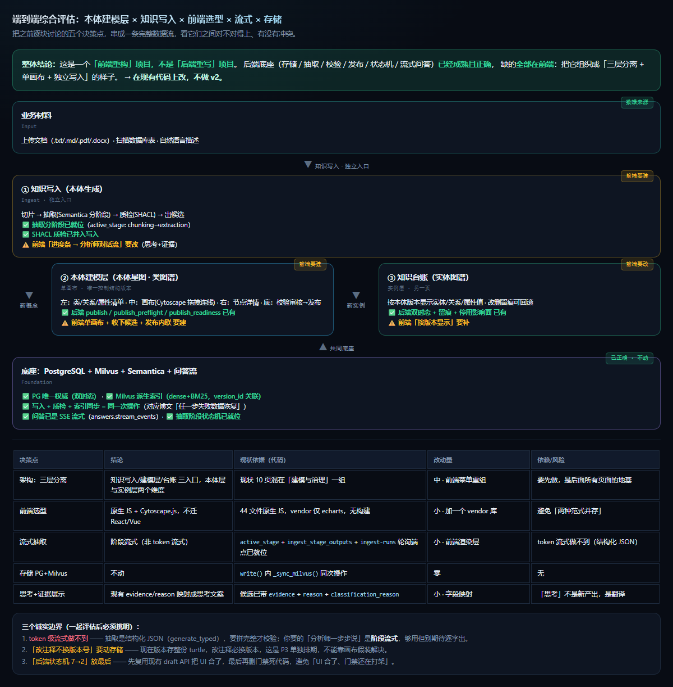

# 本体建模层实施规划与验收（2026-10-04）

> 承接《2026-10-04-本体建模层单画布设计.md》（讲「是什么」），本文讲「怎么分步做、怎么跟踪进度、怎么整体验收」。
> 目标：把「知识写入 → 本体建模 → 发布 → 台账 → 消费」这条**端到端链路**一次做通，再整体测试。

## 0. 设计案例（做完长什么样，照着实现用）

> 所有样例截图与 HTML 设计稿都在 `docs/assets/`。按「架构 → 界面 → 流程 → 评估」顺序看，先建立直观认识再动手。

### 0.1 最终架构：三层分离（先看这张，这是定调）

　[打开 HTML 设计稿](assets/ontology-architecture-v2.html)

**知识写入（本体生成）/ 本体建模层（本体星图·类图谱）/ 知识台账（实体图谱）** 三层分开，本体层与实例层两个维度。这是所有后续界面的骨架，先记住三入口各管什么。

### 0.2 本体建模层界面样例（单画布）

　[打开 HTML 设计稿](assets/ontology-canvas-design-v4.html)

左＝**类/关系/属性**三维清单（属性带数据类型徽标）· 中＝画布（父子实线 / 关系虚线 / 待收下虚线）· 底＝「校验并审核 → 发布 vN+1」。
> ⚠️ 本图右栏画的是「知识写入」，**最终定位已改为右栏＝节点详情**（点类看属性/关系/规则/实体），知识写入移到独立入口——以 §0.1 架构为准，本图只看左栏/画布/底栏的样式。

### 0.3 分析师对话流（知识写入入口的抽取展示）

　[打开 HTML 设计稿](assets/ontology-canvas-design-v5.html)

上传文档后，抽取以「💭思考 + 📄证据 + 收下/忽略」**逐步展开**，不再是后台任务进度条。阶段流式（非 token 流式）。

### 0.4 校验与审核流程

　[打开 HTML 设计稿](assets/ontology-flow.html)

两层校验（结构层 SHACL / 实例层 domain·range）＋两个审核点（收下概念 / 批准冲突知识）。

### 0.5 端到端评估基线

　[打开 HTML 设计稿](assets/ontology-e2e-assessment.html)

数据流 × 三层 × 底座 × 改动标注：后端全绿（不动），缺的都在前端。

## 1. 完整链路（验收主线）

```
上传文档 / 自然语言
   │  ①知识写入（独立入口）：切片 → 抽取(Semantica 分阶段) → 质检(SHACL) → 出候选
   │     · 阶段流式「分析师对话流」：💭思考 + 📄证据 + 收下/忽略
   ├─ 新概念(类/关系/属性) ──▶ ②本体建模层（单画布）
   │                             画布收下(虚线) → 校验并审核 → 发布 vN+1
   └─ 新实例(实体/关系/属性值) ─▶ ③知识台账：按版本显示 · 改删留痕可回滚
                                              │
                         ④消费：检索 / 问答 / 脑图 用新发布的本体
```

## 2. 能力矩阵（进度跟踪总表）

状态约定：⬜ 未开始 · 🔨 进行中 · ✅ 已完成待验证 · ✔️ 已验证（真机跑通）
「现状」列区分：**后端**（服务能力）vs **前端**（界面能力）。

| # | 能力 | 现状 | 期 | 验收标准（做完=✔️） | 状态 |
|---|---|---|---|---|---|
| A1 | 三层菜单（本体层/实例层/消费/运行） | ❌ 前端（10 页混 3 组） | P0 | 侧栏分 4 组，本体层/实例层各独立一组 | ✅ |
| A2 | 3 本体页合并为「本体建模层」（10→7 入口） | ❌ 前端 | P0 | 只剩「本体建模层」一个结构页，审核台/编辑台/档案/候选脑图/审核并入 | ✅ |
| A3 | 契约测试同步重写 | ❌ | P0 | `test_frontend_static_contract.py` + 相关 `.cjs` 全绿 | ✅ |
| B1 | 左栏三维清单（类/关系/属性 + 数据类型） | ✅ 前端基础（`ontology-model.js` 已加载） | P1 | 三组清单可点选中，属性带 dtype | ✔️ |
| B2 | 画布图渲染（节点 + 父子/关系边） | ⚠️ 前端手写 SVG，**连线有问题** | P1 | 换 Cytoscape.js，父子实线 / 关系虚线 / 待收下虚线三种边正确 | ✔️ |
| B3 | 画布编辑（拖节点 / 拖连线 / 新建三维） | ❌ 前端 | P1 | 能拖节点、拖出连线、新建类/关系/属性 | ✅ |
| B4 | 节点选中 → 右栏详情（属性/关系/规则/实体） | ❌ 前端 | P1 | 点类，右栏显示它的属性、允许关系、规则、相关实体 | ✔️ |
| B5 | 视图切换（图谱/分层） | ❌ 前端 | P1 | 顶栏开关切力导向/分层布局 | ✔️ |
| B6 | 版本历史抽屉 | ⚠️ 后端有历史，前端未接 | P1 | 顶栏「版本历史」弹出历史列表/Diff | ✔️ |
| B7 | 底栏动作条（校验并审核 → 发布） | ⚠️ 前端骨架，未接后端 | P1 | 调 `publish_readiness` 出 N冲突/N阻断；调 `publish` 发布 vN+1 | ✅ |
| B8 | 收下/忽略候选（虚线 → 实线） | ❌ 前端 | P1 | 收下后虚线节点转实线、进本版本 | ✅ |
| C1 | 上传文档（.txt/.md/.pdf/.docx） | ✅ 后端 | P1 | 知识写入入口可上传并触发抽取 | ✅ |
| C2 | 自然语言描述 | ✅ 后端（Semantica discover） | P1 | 入口可输入自然语言触发抽取 | ✅ |
| C3 | 阶段流式「分析师对话流」 | ✅ 后端阶段状态机（`active_stage`）· ❌ 前端 | P1 | 抽取过程逐步显示「思考+证据」，不是进度条等结果 | ✔️ |
| C4 | 候选列表（收下/忽略/累加） | ❌ 前端 | P1 | 候选卡片可收下/忽略；多批不覆盖已收下 | ✅ |
| C5 | 候选分流（概念→建模层 / 实例→台账） | ✅ 后端（review_candidates / 派生记录） | P1 | 新概念进画布虚线，新实例进台账 | ✅ |
| D1 | 知识台账按本体版本显示 | ✅ 前后端（`records-view.js` `buildOntology()`） | P2 | 台账每行挂「哪个本体版本」，可切版本看 | ✔️ |
| D2 | 改删留痕 + 回滚 | ✅ 前后端（`/records/{id}/history` + 撤销入口） | P2 | 台账改删直接生效、留痕、可回滚 | ✔️ |
| D3 | 影响面提示（不可逆动作） | ✅ 后端（停用 `impact.record_count`） | P2 | 停用/改类型弹影响面 | ✔️ |
| E1 | 标注/结构分开计量（改注释不换版本号） | ✅ 后端 | P3 | 改注释复用当前版本号、照样留痕 | ✔️ |
| E2 | 状态机 7→2 + 删门禁死代码 | ✅ 后端（0005 已收成 3 态，阶段改为推导） | P3 | draft 治理状态收敛，删阶段条死代码 | ✔️ |
| F1 | 端到端完整链路整体验收 | ⚠️ | 收尾 | 结构层写路径已真机跑通（`scripts/verify_ontology_model.py`：改父类→草案→校验并审核→发布 v2→新版本 id）；写入链路已真机跑通（`scripts/verify_ingest_end_to_end.py`：上传→LLM 抽取→**知识带本体类型入台账**，实测一轮 35 条记录/33 条实体关系） | ✔️ |
| F1b | 待审候选受理决策 | ✅ 后端 | 收尾 | 候选能被决策且不再 pending（`scripts/verify_review_decision.py`）。**契约**：违反 domain/range 的候选只能驳回，本体校验会精确拒绝收下；新概念候选属 C5 分流去建模层 | ✔️ |
| F2 | 全量测试（pytest + node --test） | ⚠️ | 持续 | 两套测试全绿 | ✔️ |
| F3 | LLM 抽取预算（推理模型） | ✅ 后端 | 收尾 | 抽取调用显式给 `max_tokens`（默认 65536，`KG_LLM_MAX_TOKENS` 可覆盖），并不再吞掉底层异常 | ✔️ |

## 3. 分期与依赖

| 期 | 范围 | 依赖 | 交付物 | 验证 |
|---|---|---|---|---|
| **P0** | A1–A3 菜单三层重组 | 无 | 侧栏 7 入口 + 契约测试重写 | `test_frontend_static_contract.py` 全绿 |
| **P1** | B1–B8 + C1–C5 画布 + 知识写入入口 | P0 | 单画布（Cytoscape）+ 独立写入入口 + 分析师对话流 + 收下/发布 | 真机：上传→抽取→收下→发布→台账可见 |
| **P2** | D1–D3 台账按版本 + 留痕回滚 | P1 | 台账版本列 + 回滚入口 + 影响面 | 真机：改删留痕、切版本显示 |
| **P3** | E1–E2 存储计量 + 状态机 | P1 之后可并行 | 迁移 + 状态机收敛 | 全量回归 + 真机验收 |

> 依赖方向严格向下：P0 是地基（不先做，后面页面无处挂）；P1 是核心闭环（价值最大）；P2/P3 可并行推进。

## 4. 端到端整体验收场景（做完 F1 时逐条跑）

1. 上传一份含新概念的文档 → 右侧分析师逐步展示「正在切片 → 识别业务对象 → 提取关系 → 校验」，每条候选带思考+证据。
2. 收下 1 个新类 + 1 个新关系 → 画布出现虚线节点；忽略 1 个 → 不出现。
3. 画布拖拽该节点、拖出连线到已有类 → 选中类，右栏显示属性/关系/规则。
4. 点「校验并审核」→ 底栏显示 N冲突/N阻断（0 则绿）。
5. 点「发布」→ 版本变 vN+1，虚线节点转实线。
6. 切到知识台账 → 新实体按新版本显示；改一条 → 留痕；回滚 → 恢复。
7. 检索/问答 → 能命中新发布的类型与实体。
8. 两套测试（`python -m pytest -q` + `node --test tests/service/*.test.cjs`）全绿。

## 5. 当前基线（如实，含缺失）

- **P0 已完成（2026-10-04）**：侧栏 7 入口分 4 组（本体层 · 结构 / 实例层 · 知识 / 消费层 · 用起来 / 运行层 · 跑起来），结构层只剩「本体建模层」一个入口；「知识审核」「原文数据源」分别并入「知识台账」「知识写入」（旧页面代码保留、入口移除，P1 搬功能后删除）。契约测试 `test_frontend_static_contract.py`（33 passed）+ `.cjs`（42 passed）全绿。
- **P1 单画布已落地（2026-10-04）**：前端拆三个文件、只经契约通信 ——
  `ontology-model.js`（主控：状态 / 事件总线 / 加载 / 草案读写 / 左栏三维清单）、
  `ontology-model-canvas.js`（Cytoscape 画布：图谱＝紧凑网格矩阵、分层＝继承深度层带）、
  `ontology-model-panel.js`（右栏详情 + 底栏动作条 + 版本历史抽屉）；
  「知识写入」抽出独立页 `ingest-flow.js`（分析师对话流 + 候选收下/忽略 + 分流标注）。
  接口契约见 `docs/2026-10-04-P1前端实现契约.md`；图编辑用 Cytoscape.js v3.30.2（`web/vendor/cytoscape.min.js`）。
  **真机实测**（1680×950，项目「PG 端到端验收」）：画布渲染 29 类 / 52 边（zoom 0.91，铺满画布）；
  点类右栏出详情（属性 / 允许关系 / 规则 / 相关对象，每块都写「做什么 / 不做什么」）；
  分层视图 8 条层带含「第 N 层（续）」；连线模式提示「连线中：点目标卡片设为「X」的父类」；
  底栏渲染「29 类型 · 24 关系 · 10 属性 · 0 冲突 · — 阻断」+「校验并审核 / 发布为 v2」（无草案时正确禁用并写明原因）；
  版本历史抽屉列出 v1 详情；知识写入页分析师对话流渲染（明说「阶段流式，不是 token 流式」）。
  两套测试全绿：`pytest` 36 passed / `node --test` 42 passed。
- **P1 未验到的写路径**：B3（改父类/改关系）、B7（发布）、B8（收下候选）、C4（候选收下）只验到
  「交互链路通、渲染正确」，**未真机提交过**（不拿用户数据试写）——留到 F1 端到端验收时补。
- 台账按版本（D1）、改删留痕回滚（D2）、影响面（D3）**前端未做**（后端已就绪，P2）。
- 存储计量（E1）、状态机收敛（E2）**未动**，P3 单独排期。
- 旧的审核台 / 编辑台 / 档案 / sources 前端文件**仍在磁盘**（菜单入口已移除），待清理。

## 6. 进度跟踪约定

- 每完成一项，把 §2 能力矩阵对应行「状态」从 ⬜→🔨→✅→✔️，并记入 README「文档索引」指向的落地进度文档。
- 「✅已完成待验证」与「✔️已验证」严格区分：只有真机跑通对应验收场景才标 ✔️。
- 任何「能力缺失」都必须在 §2 矩阵里有行，不允许「做完才发现漏了」。
