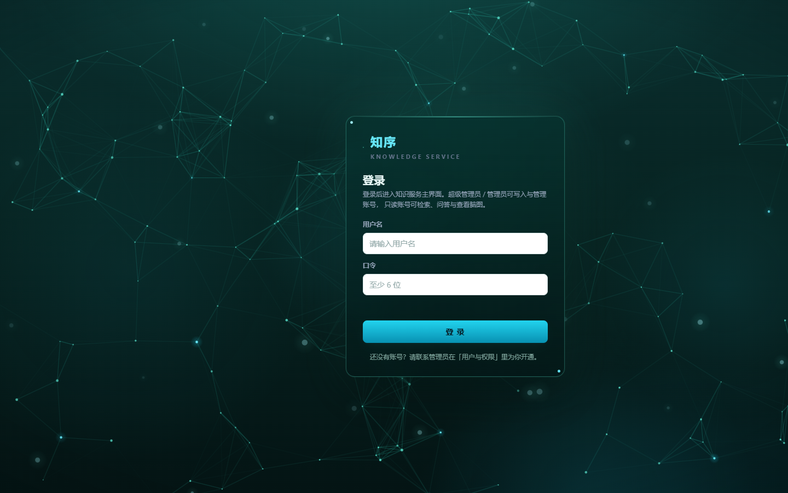
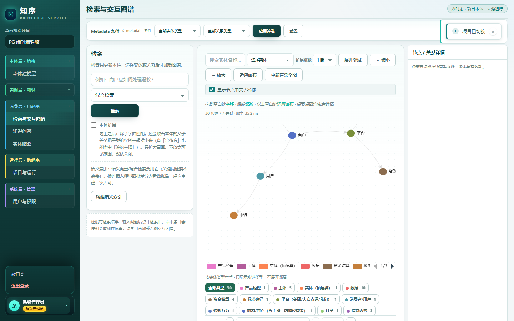
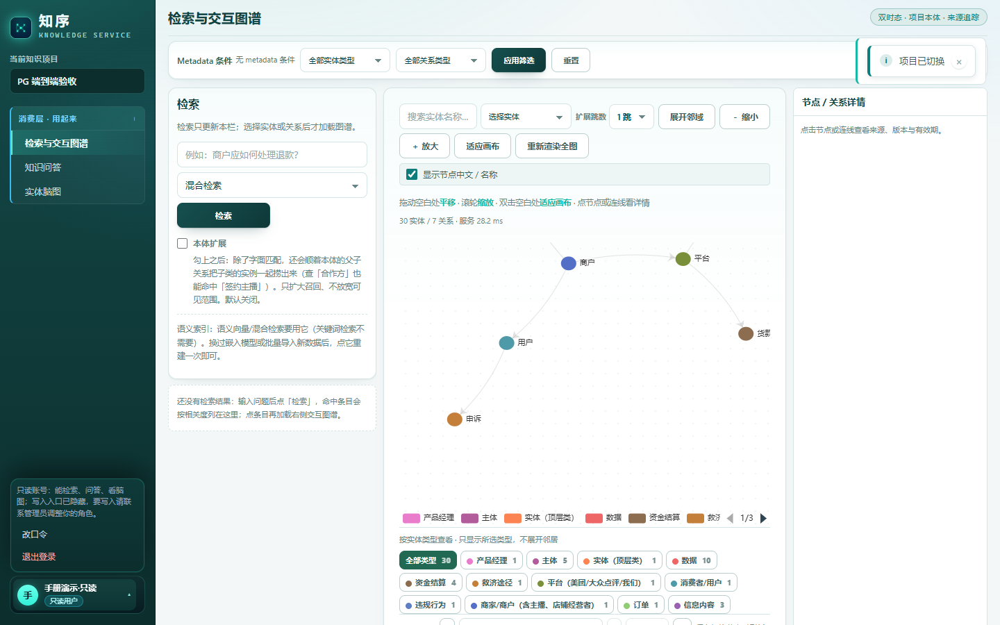
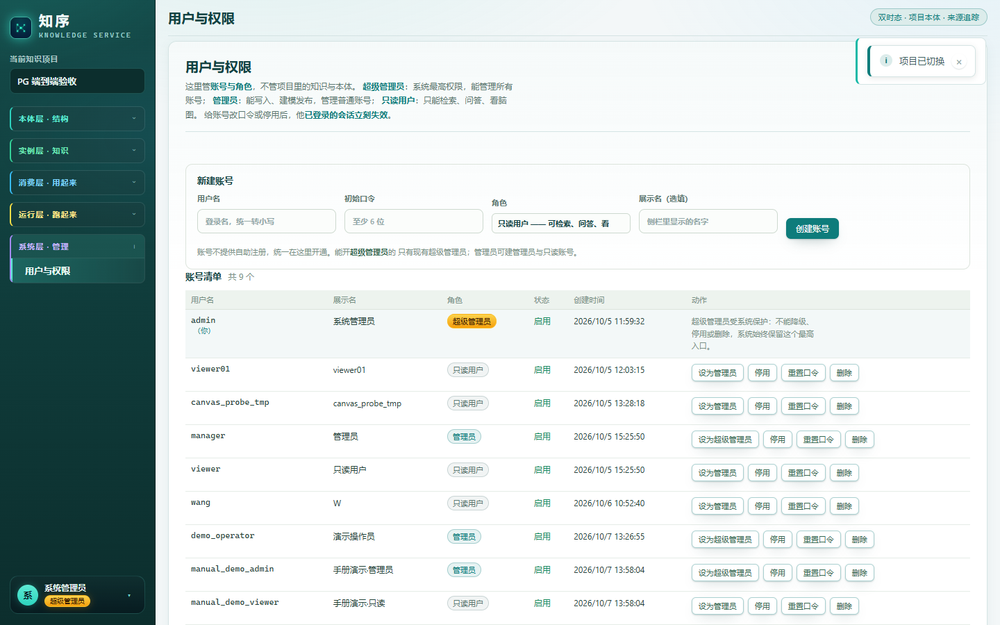
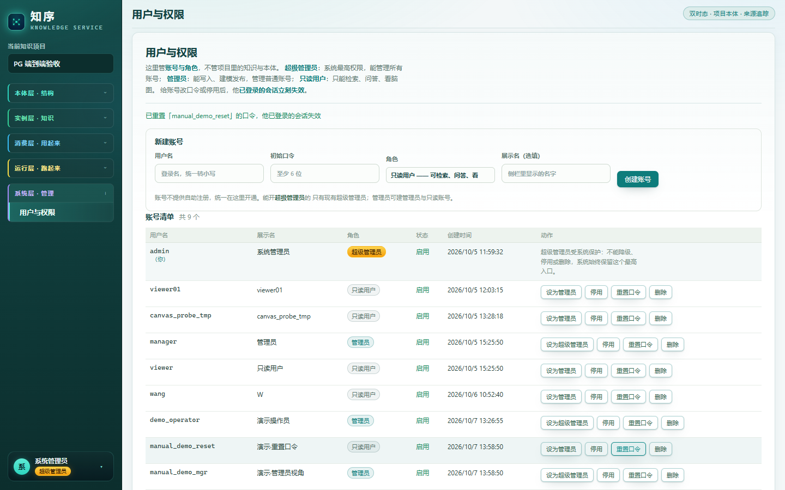
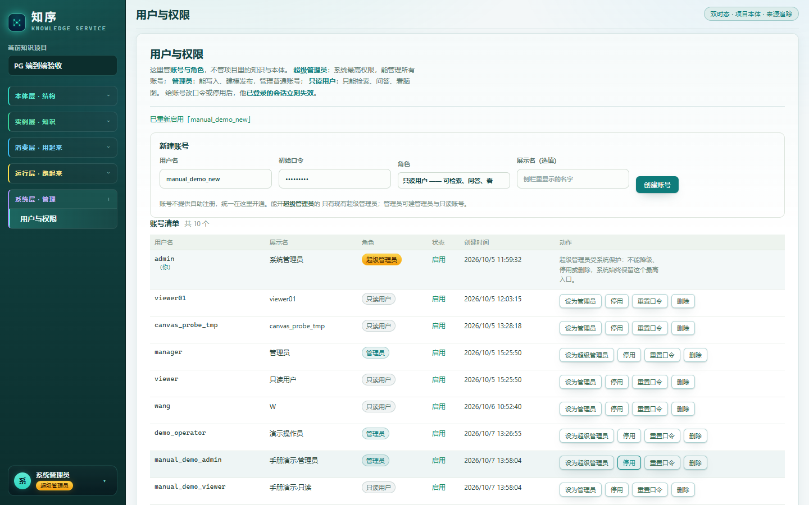
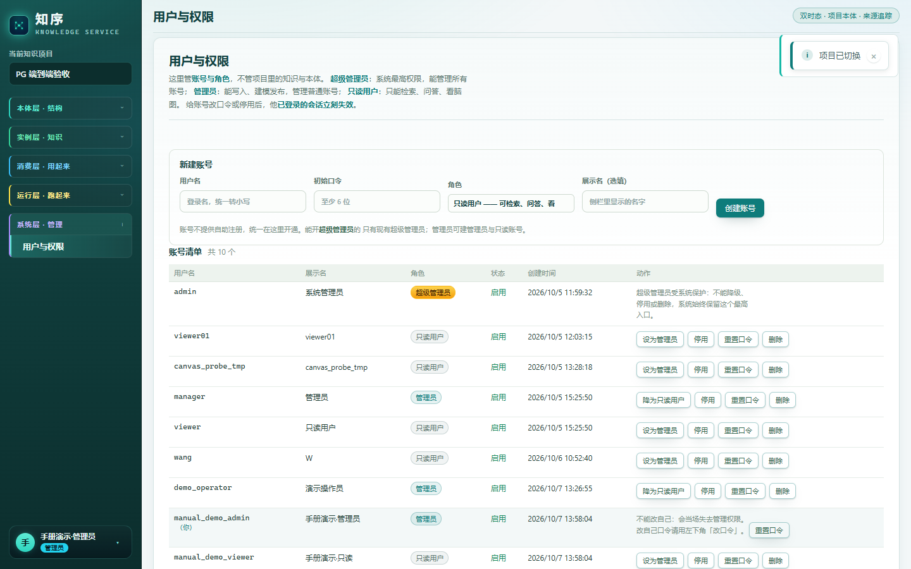
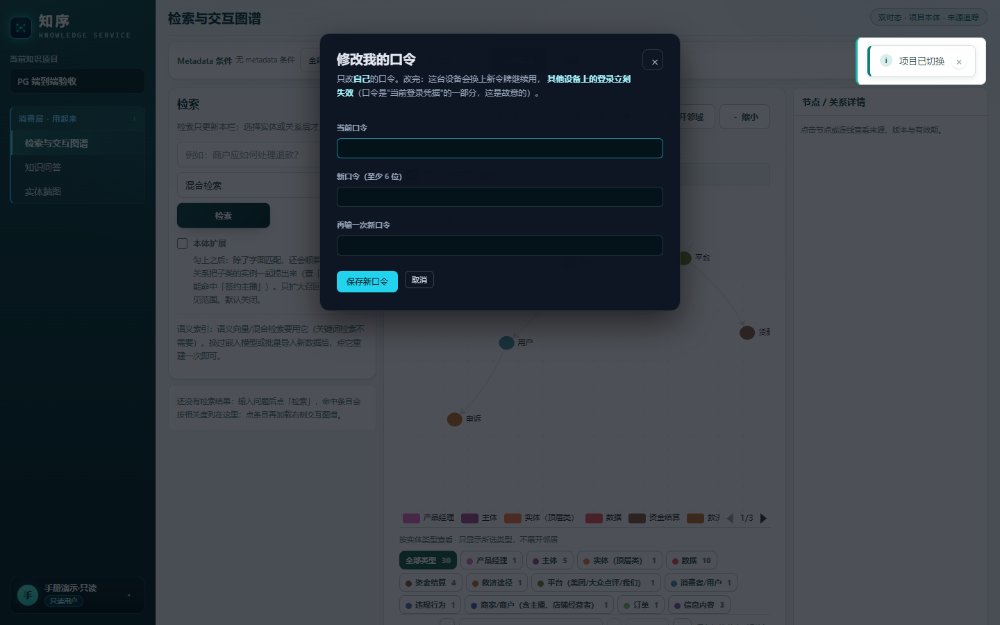
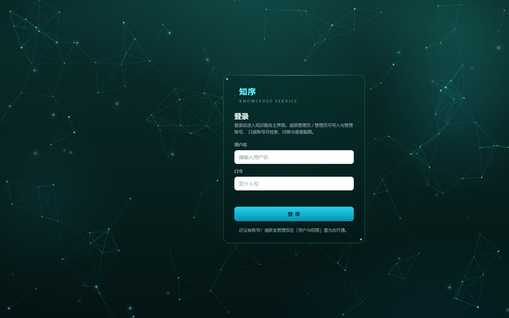

# 用户手册 · 登录 / 账号 / 权限

> 适用版本：2026-10-07 的 master（三档角色 superadmin / admin / viewer）。
> **本手册只讲"怎么用"，每个界面动作都配了真机截图与实测结果**——截图取自本机
> `http://127.0.0.1:8100` 上真实跑起来的服务，不是设计稿。
> 不含：知识写入五环节、本体建模、台账、检索问答的**操作细节**（那些各有文档，见文末"相关文档"）。

---

## 0. 一分钟上手

| 我是谁 / 我想干什么 | 去哪 | 做什么 |
|---|---|---|
| 第一次进来 | 浏览器打开服务地址（开发环境 `http://127.0.0.1:8100/`） | 未登录会自动跳到登录页，用管理员给你的用户名 + 口令登录 |
| 我要给别人开个账号 | 侧栏 **系统层 · 管理 → 用户与权限** | 填「用户名 / 初始口令 / 角色 / 展示名」→ 点「创建账号」 |
| 我要停掉某人的权限 | 同上，找到他那一行 | 点「停用」（想彻底删掉再点「删除」） |
| 我要改别人的口令 | 同上，找到他那一行 | 点「重置口令」→ 在弹出的框里输入新口令 |
| 我要改自己的口令 | 左下角自己那条 → 点开 → **改口令** | 填「当前口令 / 新口令 / 再输一次」→ 保存 |
| 我要退出 | 左下角自己那条 → **退出登录** | 回到登录页，本机令牌被清掉 |
| 我只能查知识（只读账号） | 直接登录即可 | 能检索、问答、看脑图；写入口不会显示给你 |

> ⚠️ **第一次登录后请立刻改掉默认口令**。空库首次启动会播种一个超级管理员
> `admin` / `admin123`（见 §9），只要没人改过，任何知道这个默认值的人都能登录并写入。

---

## 1. 登录、退出、掉线

### 1.1 打开服务

- 打开服务地址后，**没登录会整页跳到独立登录页**（不是弹窗盖在首页上）：
  实测访问 `/` 会变成 `http://127.0.0.1:8100/login?next=%2F`，登录成功后回到你本来要去的页面。



登录页上只有两件事能填：**用户名**、**口令**；页脚写的是
「还没有账号？请联系管理员在「用户与权限」里为你开通。」——
**本系统没有自助注册**（故意去掉的：开放注册等于任何能访问本服务的人都能给自己开一个"能读全部知识"的账号）。

### 1.2 登录失败会看到什么

| 情况 | 界面表现 | 实测 |
|---|---|---|
| 用户不存在 / 口令错 / 账号被停用 | 卡片内红字 **「用户名或口令不正确」** | 401，三种情况同一句话（不告诉你账号是否存在，防枚举） |
| 用户名没填 | 红字「请填写用户名」 | 前端校验，不发请求 |
| 口令不足 6 位 | 红字「口令至少 6 位」 | 前端校验，不发请求 |
| 服务连不上 | 红字「网络异常，请稍后重试」 | — |

### 1.3 登录成功后你看到什么

左下角出现**会话区**：头像（展示名首字）+ 展示名（鼠标悬停看用户名）+ 角色徽章，点一下才展开操作。



- 点开会话区 → 菜单项只有两个：**改口令**、**退出登录**（管理入口不在这里，在侧栏的「系统层 · 管理」）。
- 侧栏分组随身份变：管理员能看到 **本体层 · 结构 / 实例层 · 知识 / 消费层 · 用起来 / 运行层 · 跑起来 / 系统层 · 管理**；只读用户只剩 **消费层 · 用起来**（见 §3）。

### 1.4 什么时候会被"踢"回登录页

被踢回登录页只有一个原因：**手上的令牌不再有效**。四种触发（都会跳到 `/login`）：

1. 令牌过期（默认 **12 小时**，运维可调 `KG_JWT_TTL_SECONDS`）；
2. 管理员**停用**了你的账号；
3. 管理员**重置**了你的口令；
4. 你自己在别处**改了口令**（或服务端换了 `KG_JWT_SECRET`、服务重启且没配密钥）。

> 特意说明一条："令牌还有效"不等于"账号还能用"——每次请求后端都会回数据库核对
> 账号是否启用、口令指纹是否还是当前那个（`security_middleware.py` §3）。
> **所以改口令 / 停用是立刻生效的，不需要等令牌过期。**

> 实测细节：被踢的这一跳是**静默的**——落到 `/login?next=%2F`，登录页**不会显示红字解释原因**
> （只把本机令牌清掉）。所以"突然回到登录页"时，先回想是不是刚被重置了口令或被停用；
> 用旧口令再登一次会看到「用户名或口令不正确」，用新口令即可正常进入。

**改自己口令时不会把你踢下线**：前端改完会立刻用新口令换一枚新令牌继续用本机；
**其他设备**上的旧令牌立刻作废（实测：改口令后旧口令登录 401、新口令 200）。

---

## 2. 三种角色

| 角色 | 一句话 | 能做什么 | 不能做什么 |
|---|---|---|---|
| **超级管理员** `superadmin` | 系统之根 | 一切账号操作（含把管理员提为超级管理员）；写入知识、建模发布 | 不能把自己降级 / 停用 / 删除（**谁也做不到**，见 §6） |
| **管理员** `admin` | 干活的 | 写入知识、建模发布、建项目；管理 **admin / viewer** 账号 | 碰不了超级管理员账号（不能改、不能停、不能删、也不能把人提为超管） |
| **只读用户** `viewer` | 看知识 | 检索、问答、实体脑图、看台账 / 本体 | 任何写入；连「用户与权限」都看不到 |

**只读用户登录后长这样**（侧栏只剩一组菜单，会话区写明"我不能做什么"）：



> 🔒 **前端藏入口只是体验，真正的门在后端**。实测：只读账号直接调接口一样被拦——
> `POST /api/users` → 403「用户与权限只有管理员能看，当前账号是只读用户」；
> 调写入接口 → 403「当前账号为只读用户，仅可检索、问答与查看脑图，不能写入」。

---

## 3. 「用户与权限」页面

入口：**侧栏 → 系统层 · 管理 → 用户与权限**（只读用户看不到这一组，整组会消失）。



### 3.1 新建账号（上半部分）

| 字段 | 说明 |
|---|---|
| **用户名** | 登录名。**统一转小写**（填 `Alice` 会变成 `alice`），重复会报「该用户名已被注册」 |
| **初始口令** | **至少 6 位**。这是你给对方的临时口令，建议让他登录后自己改（左下角「改口令」） |
| **角色** | 三档下拉：`只读用户 —— 可检索、问答、看脑图` / `管理员 —— 可写入，并管理普通账号` / `超级管理员 —— 系统最高权限` |
| **展示名（选填）** | 侧栏里显示的名字；留空就显示用户名 |
| **创建账号** 按钮 | 成功回执形如 **「已创建「xxx」（只读用户）」** |

- 账号**只能在这里开**，页面上写着「账号不提供自助注册，统一在这里开通」。
- **能创建超级管理员的只有现有超级管理员**；管理员可以建管理员与只读账号。
  实测：管理员尝试建超管 → 403「只有超级管理员能创建超级管理员账号…」。

### 3.2 账号清单（下半部分）

表头：**用户名 / 展示名 / 角色 / 状态 / 创建时间 / 动作**；标题右侧显示 **共 N 个**。
你自己那一行会带「（你）」标记；状态列是「启用 / 已停用」。

**动作列里有什么按钮，取决于"你是谁 + 那一行是谁"**（这就是本系统权限边界的界面体现）：

| 那一行是… | 超级管理员看到 | 管理员看到 |
|---|---|---|
| 超级管理员 | **没有任何按钮**，只有一句保护说明 | **没有任何按钮**，只有一句保护说明（能看见、动不了） |
| 管理员 | 设为超级管理员 / 停用 / 重置口令 / 删除 | 降为只读用户 / 停用 / 重置口令 / 删除 |
| 只读用户 | 设为管理员 / 停用 / 重置口令 / 删除 | 设为管理员 / 停用 / 重置口令 / 删除 |
| **我自己** | 只有 重置口令 + 一句「不能改自己…」 | 同左 |

注意两处**刻意的不对称**（不是 bug，是保护）：

1. **超级管理员行没有任何按钮**：超管账号不能被降级 / 停用 / 删除（谁都不行，包括他自己）。
2. **超级管理员看管理员行只有「设为超级管理员」**，没有"降为只读"；
   而**管理员**看管理员行才有「降为只读用户」。也就是说"降级一个管理员"这件事，
   得由另一个管理员来做（或者直接停用 / 删除）。

---

## 4. 管理员日常任务（逐步）

### 4.1 开一个新账号（只读为例）

1. 侧栏点「用户与权限」；
2. 用户名填 `zhangsan`，初始口令填 `zhang123`，角色选「只读用户」，展示名填「张三」；
3. 点「创建账号」→ 顶部出现 **「已创建「zhangsan」（只读用户）」**，清单计数 +1；
4. 把用户名和初始口令告诉本人，让他登录后自己改口令。

### 4.2 改角色（升级 / 降级）

- 在目标行点 **「设为管理员」**（把只读提为管理员）→ 若这一步是**降级**，会先弹确认框
  「把「xxx」降为只读用户？他立刻不能再写入或建项目。」；
- 确认后回执：**「已把「xxx」设为管理员」/「已把「xxx」降为只读用户」**；
- **立刻生效**：他手上已登录的会话不用重新登录，但下一次请求就按新角色判权限（后端每次请求都回查角色）。

### 4.3 停用 / 启用

- 点 **「停用」** → 确认框「停用「xxx」？他已登录的会话会立刻失效，也不能再登录。」；
- 回执「已停用「xxx」」，状态列变成 **已停用**，按钮变为 **「启用」**（点它恢复登录，回执「已重新启用「xxx」」）；
- 停用**保留账号与历史**，只是不让登录——"先停用、观察一段再删"是更安全的做法。

### 4.4 重置别人的口令

1. 目标行点 **「重置口令」** → 弹出输入框：`给「xxx」设置新口令（至少 6 位）：`；
2. 输入（少于 6 位会提示「口令至少 6 位」）→ 回执 **「已重置「xxx」的口令，他已登录的会话失效」**；
3. 实测确认：**旧口令立刻登录失败（401），新口令可以登录（200）**。



### 4.5 删除账号

- 点 **「删除」** → 确认框写得很直白：
  「删除账号「xxx」？这是物理删除，登录名会被释放，且无法恢复。如只是想阻止登录，建议改用「停用」。」
- 回执「已删除账号「xxx」」，清单里不再有他（实测：删完清单里查不到，登录名可被重新使用）。



### 4.6 管理员视角（换个账号看同一页面）

管理员看到的清单里**能看见超级管理员那一行**，但动作列是空的；对别的管理员行，
按钮是「降为只读用户」而不是「设为超级管理员」。



---

## 5. 改自己的口令

入口：**左下角会话区 → 点开 → 改口令**（三种角色都能改自己的）。



- 三个框：**当前口令** / **新口令（至少 6 位）** / **再输一次新口令**；
- 校验：当前口令必填；新口令 ≥ 6 位；两次必须一致（否则红字提示，不会提交）；
- 点 **「保存新口令」** → 成功提示 **「口令已更新：其他设备上的登录已失效。」**；
- **为什么必须填当前口令**：令牌万一泄漏，光有令牌不能把口令改掉、把真主顶下线；
- 改完本机自动换成新令牌（不会被自己踢下线），**其他设备的登录立刻失效**。

---

## 6. 保护规则（为什么有些按钮点了会被拒）

这些规则在界面上大多直接不摆按钮，但你若绕过界面调接口，后端会明确拒绝（下面是真机实测的返回）：

| 你想做的事 | 结果 | 服务端说明（原文） |
|---|---|---|
| 管理员改 / 停 / 删 **超级管理员** | 403 `cannot_manage_superadmin` | 「超级管理员账号不在管理员的管辖范围内：只有超级管理员能查看或修改它。」 |
| 管理员把某人**提升为超级管理员** | 403 `cannot_grant_superadmin` | 「只有超级管理员能把账号提升为超级管理员：当前管理员无权授予系统最高权限。」 |
| 超级管理员**降级 / 停用自己**（或任何超管账号） | 409 `superadmin_protected` | 「超级管理员账号受系统保护，不能降级或停用：系统必须始终保留至少一个可登录的最高权限入口。可改展示名，或新建/提升其他账号。」 |
| 超级管理员**删除超管账号** | 409 `superadmin_protected` | 「…不能删除：系统必须始终保留至少一个可登录的最高权限入口。如不再需要某个账号，请改用「停用」。」 |
| 管理员**降级 / 停用 / 删除自己** | 409 `cannot_modify_self` | 「不能降级或停用当前登录的自己：这会让你当场失去管理权限。如要交出管理员，请用另一个管理员账号操作。」 |
| 只读用户调用任何写入 / 管理接口 | 403 | 「当前账号为只读用户，仅可检索、问答与查看脑图，不能写入」 |

一句话原则：**系统永远保留一个可登录的最高权限入口，而且当前登录的人不能把自己锁死在门外。**

---

## 7. 常见问题（FAQ）

**Q1：我登录了但一直被弹回登录页？**
A：说明手上的令牌被作废了。按 §1.4 对四条原因排查；最常见的两条是"管理员停用了你"或"管理员重置了你的口令"。
注意**这一跳是静默的**：登录页不会写原因（实测红字为空），只把本机令牌清掉。

**Q2：我忘了口令怎么办？**
A：找管理员（admin）在「用户与权限」里点 **重置口令**，他会把新口令告诉你，你登录后自己再改一次。

**Q3：超级管理员忘记了口令怎么办？**
A：**目前没有自助找回入口**（已知缺口，见 §9）。可用的办法：用另一个超级管理员在页面上给他「重置口令」；
如果一个超级管理员都没有了，只能由 DBA 用库的 owner 凭据改 `users.password_hash`
（哈希值要用 `knowledge_service.core.security.hash_password` 生成，别自己拼字符串）。

**Q4：为什么我看不到「用户与权限」？**
A：你是只读用户。侧栏「系统层 · 管理」整组会对只读用户隐藏；想管账号请让超级管理员把你调成管理员。

**Q5：为什么「设为超级管理员」这个按钮不在？**
A：只有超级管理员能授予超级权限；管理员看不到这个按钮（后端也会拒，403 `cannot_grant_superadmin`）。

**Q6：我只想让他暂时不能登录，该用「停用」还是「删除」？**
A：**停用**。停用保留账号与历史、随时可恢复；删除是物理删除、登录名会被释放且无法恢复。

**Q7：能自助注册吗？**
A：不能，且是故意的（`POST /api/auth/register` 已不存在，实测直接打它会因未登录返回 401）。
账号统一由管理员在「用户与权限」里开。

**Q8：登录能保持多久？**
A：默认 12 小时（`KG_JWT_TTL_SECONDS=43200`）。到期后重新登录即可；期间若被改口令 / 停用，立刻失效。

---

## 8. 给运维 / 开发者

### 8.1 关键环境变量

| 变量 | 作用 | 默认 |
|---|---|---|
| `KG_SEED_ADMIN_USERNAME` / `KG_SEED_ADMIN_PASSWORD` | **空库首次启动**播种的超级管理员；老库（无超管）会把该账号提升为超管 | `admin` / `admin123` |
| `KG_JWT_SECRET` | JWT 签名密钥。**不配**则用进程级随机密钥：重启后所有人需重新登录 | 无（警告并随机生成） |
| `KG_JWT_TTL_SECONDS` | 令牌有效期（秒） | `43200`（12 小时） |
| `KG_AUTH_DISABLED` | `1` 时**关闭认证授权中间件**（仅本地调试 / 测试桩用，别在生产开） | 未设置＝启用鉴权 |

服务启动时会打印告警：仍在使用默认口令 `admin123`、或没配 `KG_JWT_SECRET`——两条都该处理掉。

### 8.2 起服务与迁移

```bash
conda activate model_agent
python -m knowledge_service.repository.migrate        # 幂等；应用进程不建表，启动只校验版本
python -u -m knowledge_service --port 8100            # 起服务（无 --reload，改后端要重启）
```

启动前先确认迁移号一致（`python -m knowledge_service.repository.migrate --status`
应显示"实际=期望"），否则服务会因版本校验拒绝启动。
本轮功能对应的迁移：`0008_users.sql`（用户表两档角色）、`0009_roles_three_tiers.sql`（角色扩为三档）。

### 8.3 权限判定在哪（改代码前先看这三处）

| 位置 | 管什么 |
|---|---|
| `knowledge_service/api/security_middleware.py` | 谁免登录（`PUBLIC_API_PATHS`）、哪些 POST 只读（`_READ_ONLY_POST_PATTERNS`）、哪些 GET 也要管理员（`_MANAGER_ONLY_PATTERNS`）、只读用户 403 文案 |
| `knowledge_service/api/users.py` | 三档角色之间的越权边界与超管保护（§6 那些 403/409） |
| `knowledge_service/web/auth.js` / `user-admin.js` | 前端体验：隐藏写入口、会话区、用户与权限页面（**不是安全边界**） |

---

## 9. 已知不足（还没做的）

1. **超管口令无法自助找回**（§7 Q3）：建议加一个受控 CLI（如 `scripts/reset_user_password.py`），
   或者在超管丢失时给出标准恢复步骤。
2. **角色是全局的，没有项目级权限**：只读用户能看**所有**项目。要做"某人只能看某项目"，
   需要项目 ACL 表 + 在检索 / 问答 / 台账查询里带范围过滤。
3. **没有登录失败次数限制 / 口令强度策略**：现在只有"至少 6 位"，也没有锁定；
   暴力破解只能靠外层网络策略挡。
4. **账号操作没有审计留痕**：谁在什么时候把谁停用了、重置了谁的口令，目前只写日志
   （`LOG.info`）没有可查的表；删除账号前后尤其建议留痕。
5. **操作是即时生效、没有二次确认页**：删除 / 停用只用一个浏览器 confirm 弹窗，
   误触的可能虽小，但重要账号建议先用「停用」观察。

---

## 附录 A：本轮真机验收清单（2026-10-07，实跑）

| # | 验收点 | 结果 |
|---|---|---|
| 1 | 未登录访问 `/` | 跳到 `/login?next=%2F` ✅ |
| 2 | 登录页无自助注册入口 | ✅（`POST /api/auth/register` 直接打 → 401） |
| 3 | 口令错 / 账号不存在 / 被停用 | 统一 401「用户名或口令不正确」✅ |
| 4 | 超级管理员登录 | 首页 body 类 `is-admin is-superadmin`，会话区「系统管理员 / 超级管理员」✅ |
| 5 | 用户与权限页面 | 标题、说明、表头、角色下拉、计数"共 N 个"均如 §3 ✅ |
| 6 | 建号 / 重名 / 升角色 / 停用 / 启用 / 重置口令 / 删除 | 回执文案与 §4 完全一致 ✅ |
| 7 | 重置口令后旧口令失效、新口令可用 | 旧 401 / 新 200 ✅ |
| 8 | 管理员不能建超管、不能改/停/删超管 | 403 + 对应 code ✅ |
| 9 | 超管不能降级 / 停用 / 删除自己（或超管账号） | 409 `superadmin_protected` ✅ |
| 10 | 管理员不能降级 / 删除自己 | 409 `cannot_modify_self` ✅ |
| 11 | 只读用户：侧栏无系统层、会话区有"我不能做什么"提示、能改自己口令 | ✅ body 类 `is-viewer` |
| 12 | 只读用户直调管理 / 写入接口 | 403 + 中文原因 ✅ |
| 13 | 页面 JS 报错 | 全流程 0 条 ✅ |
| 14 | 只读账号被管理员重置口令后继续操作 | 静默跳回 `/login?next=%2F`，登录页无红字；旧口令 401、新口令可登录 ✅ |



验收脚本（可重复跑，真服务 + 真浏览器；下面是本轮的实测读数）：
`scripts/verify_auth_rbac.py`（对活服务打真请求，**41/41 通过**）、
`tests/service/test_auth_rbac.py` + `tests/service/test_auth_ui.py`（真 Edge 契约，**56 passed**）、
`tests/service/test_frontend_static_contract.py`（静态契约，**55 passed**）。
三件套一起跑：`111 passed`。

## 附录 B：现象 → 原因 → 动作

| 现象 | 可能原因 | 你该做什么 |
|---|---|---|
| 一进首页就被弹到 `/login` | 没登录 / 令牌过期 / 被停用 / 被改口令 | 重新登录；仍不行找管理员看账号状态 |
| 登录成功但立刻又被弹回 | `KG_JWT_SECRET` 变了或服务重启且未配置密钥 | 让运维在 `.env` 里固定 `KG_JWT_SECRET` |
| 看不到某个写入菜单 | 你是只读用户 | 找管理员调角色 |
| 点「创建账号」提示"该用户名已被注册" | 登录名重复（用户名统一小写） | 换个用户名，或找到原账号处理 |
| 页面顶部提示"用户与权限界面没加载成功" | 前端资源版本不一致（缓存） | 强制刷新（Ctrl+F5）；仍不行让开发检查 `index.html` 里的 `?v=` 版本号 |
| 服务起不来，日志报 schema 版本不一致 | 库里迁移号与代码期望不一致 | 先跑 `python -m knowledge_service.repository.migrate` |

---

## 相关文档

- `docs/2026-10-05-用户登录与权限.md` —— 认证 / 权限的**设计与取舍**（为什么两档、令牌指纹、fail-closed）
- `docs/2026-10-05-知识写入流程与处置界面.md` —— 写入五环节怎么用
- `docs/2026-10-01-本体工作台操作手册.md` —— 本体侧操作
- `docs/2026-10-01-Docker基础设施维护手册.md` —— 起 PG / Milvus / 依赖
